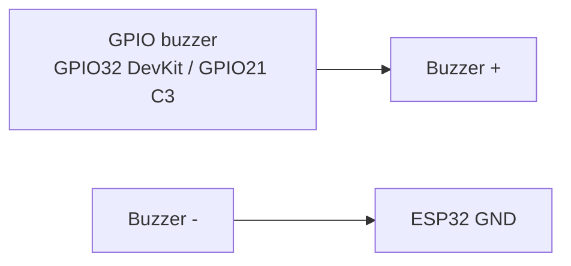
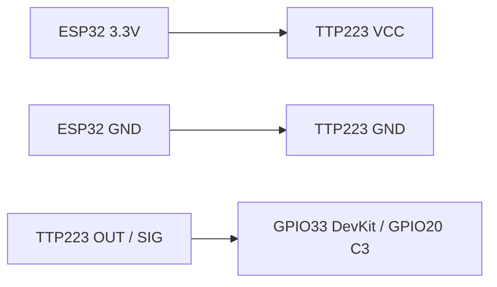
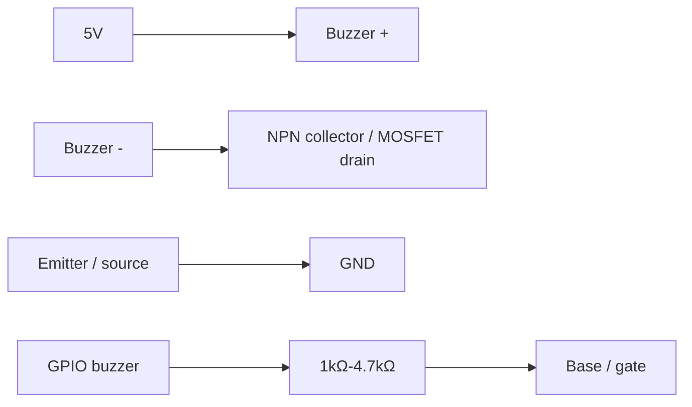
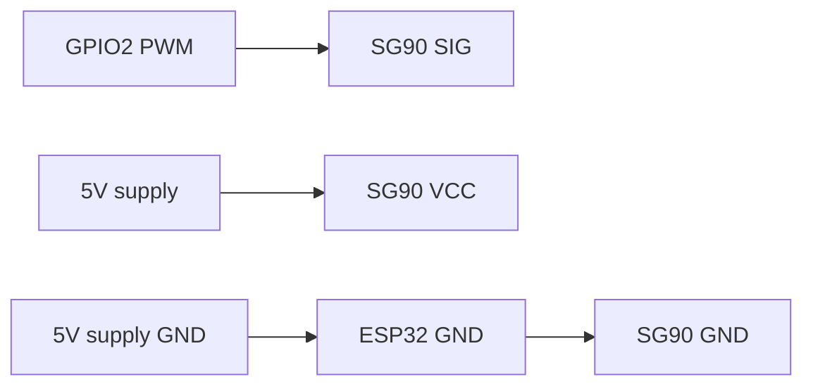
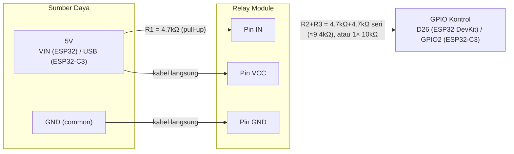

# Hardware & Wiring Reference

## Hardware Evidence Policy (Mandatory)

Before giving wiring guidance or updating this file:

1. Review hardware photos in `.github/hardware pics`.
2. Validate module identity and printed pin labels from the photos.
3. Only include Module Pinout (ASCII) for components that have photo evidence. Do not draw connection lines between modules in the ASCII diagram — use Connection Summary for wiring info.
4. If a component photo is missing, mark it as **Pending Hardware Evidence** and do not include its ASCII pinout diagram.

Current evidence in `.github/hardware pics`:

- `EPS DEVKIT V1 CP2102 Type C.jpeg` (ESP32 DevKit V1 — **Pending re-upload** if missing from folder)
- `Expansion ESP32 V1 Shiled 30 Pin.png` (ESP32 30P expansion shield — G-V-S headers, 3.3V/5V jumper, DC6.5–16V)
- `RFID RC522.jpeg` (MFRC522 module)
- `OLED 0.96 128x64 I2C IIC.jpeg` (SSD1306 OLED, pin order visible: GND, VDD, SCK, SDA)
- `LED Red and Blue.jpeg` (5mm status LEDs — red = denied, blue = granted)
- `Relay 1-Channel (5V DC).jpeg` (5V 1-channel relay module — JQC-3FF-S-Z, VCC/GND/IN, NC/COM/NO)
- `Adaptor AC-DC 9V 1A.jpeg` (optional barrel input for shield DC jack, 6.5–16V range)
- `Resistor 100 Ohm.jpeg` (LED current limit)
- `Solenoid Door lock 12V DC.jpeg` (12V DC solenoid lock — red (+) / black (−) wires, 2-pin JST-style connector)
- `ESP32-C3 Super Mini.jpg` (ESP32-C3 Super Mini — native USB-C, labeled SPI/I2C/UART pin groups)
- Active buzzer 2-pin — **Pending Hardware Evidence**
- TTP223 touch sensor module — **Pending Hardware Evidence**
- SG90 micro servo 5V — **Pending Hardware Evidence**

## Component Specifications

| Component | Model | Interface | Voltage | Notes |
|-----------|-------|-----------|---------|-------|
| Microcontroller | ESP32 DevKit V1 (CP2102, USB Type-C) | — | 3.3V logic, 5V USB power | **30-pin footprint (15+15)** per pinout below; dual-core, WiFi+BT. Wide **38-pin (19+19)** boards do **not** fit the expansion shield |
| Expansion board | ESP32 ESP32S 30P Expansion board | G-V-S headers | 3.3V or 5V on **V** (jumper) | DC6.5–16V barrel, Micro-USB, USB-C; fixed **5V / 3.3V / GND** block top-right |
| RFID Reader | RFID-RC522 (MFRC522) | **SPI** | 3.3V | 13.56 MHz, Mifare Classic/Ultralight; pins: SDA, SCK, MOSI, MISO, IRQ, GND, RST, 3.3V |
| OLED Display | SSD1306 0.96" 128x64 | **I2C** | 3.3V–5V | Address: 0x3C; pin order on module: **GND, VDD, SCK, SDA** |
| Status LED (blue) | 5mm through-hole | **Digital GPIO** | 3.3V via 100Ω resistor | Access granted indicator; anode (+) long leg |
| Status LED (red) | 5mm through-hole | **Digital GPIO** | 3.3V via 100Ω resistor | Access denied / server error; anode (+) long leg |
| Relay Module | 5V 1-Channel (JQC-3FF-S-Z) | **Digital GPIO** | 5V coil; IN needs 5V HIGH to turn off | Active LOW on IN (verified); **4.7k–10kΩ pull-up IN→5V**; GPIO 26 INPUT when locked |
| Solenoid lock | 12V DC door lock (solenoid) | **Relay COM/NO** | 12V DC | Red = (+), black = (−); ~0.5–1A; **not** to ESP32 pins |
| Power Supply | DC adapter | — | Match solenoid rating; 12V DC ≥1A required for this lock | Photo evidence is a **9V 1A** adapter, so it is not a direct 12V supply; keep load power separate from USB 5V logic |
| Microcontroller (alt) | ESP32-C3 Super Mini | — | 3.3V logic, 5V USB-C power | Single-core RISC-V, WiFi+BLE; native USB-C (no CH340) — needs `ARDUINO_USB_CDC_ON_BOOT=1` for Serial monitor; far fewer GPIOs than DevKit V1 |
| Active buzzer 2-pin | Pending photo evidence | Digital GPIO | 3.3V preferred; 5V only with transistor driver | Access feedback: 2 beeps granted, 1 beep denied |
| Touch Sensor | TTP223-style module | Digital GPIO | 3.3V | Touch-to-unlock input; OUT is active HIGH by default |
| Servo (POC) | SG90 micro servo | **PWM GPIO** | 5V VCC; 3.3V signal OK | Door open/close; **Pending Hardware Evidence**. Used when `ACTUATOR_TYPE=ACTUATOR_SERVO`. Do **not** wire relay or solenoid. |

## ESP32 Pin Capabilities & Constraints

### Pins to AVOID for output:
| GPIO | Reason |
|------|--------|
| 34, 35, 36, 39 | **Input-only** — cannot be used for output (no internal pull-up) |
| 6, 7, 8, 9, 10, 11 | **Reserved** — connected to internal flash SPI |
| 0 | Boot button — pulling LOW during boot enters flash mode |
| 2 | On-board LED on some boards; must be LOW or floating during boot |
| 12 | Boot fail if pulled HIGH during boot (MTDI strapping pin) |
| 15 | Outputs PWM signal at boot (MTDO strapping pin) |

### SPI Pins (VSPI — default):
| Function | GPIO | Fixed? |
|----------|------|--------|
| SCK (Clock) | 18 | Yes (hardware SPI) |
| MOSI (Master Out) | 23 | Yes (hardware SPI) |
| MISO (Master In) | 19 | Yes (hardware SPI) |
| SS/SDA (Chip Select) | 5 | No — configurable |

### I2C Pins (default):
| Function | GPIO | Fixed? |
|----------|------|--------|
| SDA (Data) | 21 | No — configurable, but 21 is default |
| SCL (Clock) | 22 | No — configurable, but 22 is default |

## Pin Assignment (This Project)

| ESP32 GPIO | Connected To | Interface | Notes |
|------------|-------------|-----------|-------|
| GPIO 5 | MFRC522 SDA (SS) | SPI | Chip select for RFID |
| GPIO 18 | MFRC522 SCK | SPI | SPI clock (hardware) |
| GPIO 23 | MFRC522 MOSI | SPI | SPI data out (hardware) |
| GPIO 19 | MFRC522 MISO | SPI | SPI data in (hardware) |
| GPIO 4 | MFRC522 RST | Digital | Reset pin (avoid GPIO22 — conflicts with I2C SCL) |
| — | MFRC522 IRQ | — | **Leave unconnected** (not used in this project) |
| GPIO 21 | OLED SDA (pin 4 on module) | I2C | I2C data line |
| GPIO 22 | OLED SCK/SCL (pin 3 on module) | I2C | I2C clock line — module label is "SCK" |
| GPIO 25 | Blue LED anode (via 100Ω) | Digital | Access granted — active HIGH |
| GPIO 27 | Red LED anode (via 100Ω) | Digital | Access denied / server error — active HIGH |
| GPIO 26 | Relay IN | Open-drain | Active LOW; **10kΩ IN→5V (VIN)** required — 3.3V alone cannot turn relay off |
| GPIO 32 | Active buzzer (+) | Digital | Direct drive only for 3.3V low-current buzzer; active HIGH by default |
| GPIO 33 | TTP223 OUT/SIG | Digital input | Touch-to-unlock; active HIGH by default |
| 3.3V | MFRC522 VCC, OLED VCC | Power | 3.3V rail from ESP32 |
| 5V (VIN or shield) | Relay VCC, pull-up for IN | Power | 5V coil + logic pull-up; with shield use **5V** block or D26 **V** (jumper 5V) |
| GND | All GND pins | Power | Common ground — ALL components share GND |

## Pin Assignment (ESP32-C3 Super Mini — Alternate Board)

> Firmware selects these pins automatically at compile time via `CONFIG_IDF_TARGET_ESP32C3` (PlatformIO env `esp32-c3-supermini`). Physical wiring **not yet assembled** — verify before power-up, especially GPIO8/GPIO9 below.

| ESP32-C3 GPIO | Connected To | Interface | Notes |
|---------------|-------------|-----------|-------|
| GPIO 7 | MFRC522 SDA (SS) | SPI | Chip select for RFID |
| GPIO 4 | MFRC522 SCK | SPI | SPI clock (hardware default) |
| GPIO 6 | MFRC522 MOSI | SPI | SPI data out (hardware default) |
| GPIO 5 | MFRC522 MISO | SPI | SPI data in (hardware default) |
| GPIO 10 | MFRC522 RST | Digital | Reset pin |
| — | MFRC522 IRQ | — | **Leave unconnected** (not used in this project) |
| GPIO 8 | OLED SDA | I2C | I2C data line — **strapping pin**, see risk note below |
| GPIO 9 | OLED SCL | I2C | I2C clock line — **strapping pin, also wired to on-board BOOT button** |
| GPIO 1 | Blue LED anode (via 100Ω) | Digital | Access granted — active HIGH |
| GPIO 3 | Red LED anode (via 100Ω) | Digital | Access denied / server error — active HIGH |
| GPIO 2 | Relay IN **or** SG90 SIG | Open-drain / PWM | `ACTUATOR_RELAY`: active LOW + 10kΩ series + 5V pull-up. `ACTUATOR_SERVO`: PWM to SG90 SIG. **Never both** |
| GPIO 21 | Active buzzer (+) | Digital | Direct drive only for 3.3V low-current buzzer; safe as GPIO because Serial monitor uses native USB CDC |
| GPIO 20 | TTP223 OUT/SIG | Digital input | Touch-to-unlock; safe as GPIO because Serial monitor uses native USB CDC |
| 3.3V | MFRC522 VCC, OLED VCC | Power | 3.3V rail from board |
| 5V (USB) | Relay VCC / SG90 VCC | Power | Relay: coil + IN pull-up. Servo: prefer dedicated 5V + common GND (USB 5V only for unloaded tests) |
| GND | All GND pins | Power | Common ground — ALL components share GND |

### Active Buzzer 2-Pin Wiring (Pending Hardware Evidence)

For a 2-pin active buzzer, the GPIO drives the buzzer's **+** pin directly only when the buzzer is 3.3V-compatible and low-current. If the buzzer is 5V-only or current draw is unknown, use a transistor driver.

| Buzzer Pin | ESP32 DevKit V1 | ESP32-C3 Super Mini | Notes |
|------------|------------------|----------------------|-------|
| + | GPIO 32 | GPIO 21 | Firmware default `BUZZER_PIN`; HIGH = beep by default |
| − | GND | GND | Common ground with ESP32 |



### TTP223 Touch Unlock Wiring (Pending Hardware Evidence)

Power the touch module from 3.3V so its OUT/SIG level is safe for ESP32 GPIO. Firmware treats OUT/SIG HIGH as a touch request and unlocks the actuator for `ACTUATOR_UNLOCK_DURATION_MS` (same default 3s as `RELAY_UNLOCK_DURATION_MS`).

| TTP223 Pin | ESP32 DevKit V1 | ESP32-C3 Super Mini | Notes |
|------------|------------------|----------------------|-------|
| VCC | 3.3V | 3.3V | Keep logic level safe for ESP32 |
| GND | GND | GND | Common ground with ESP32 |
| OUT / SIG | GPIO 33 | GPIO 20 | Firmware default `TOUCH_UNLOCK_PIN`; active HIGH by default |



For a 5V buzzer, use low-side switching:



**Risk — strapping pins on I2C:** GPIO8 and GPIO9 are ESP32-C3 strapping pins (boot mode selection); GPIO9 is also tied to the board's on-board BOOT button. I2C pull-ups normally idle HIGH, which matches the expected boot state, but this **must be verified physically on first power-up** — if the OLED or its pull-ups hold either line LOW during reset, the board may enter download mode instead of booting normally.

**Note — native USB serial:** this board has no CH340/CP2102 bridge; `platformio.ini` sets `ARDUINO_USB_CDC_ON_BOOT=1` so `Serial` output appears over the USB-C port.

### ESP32-C3 — actuator servo (POC)

> SG90 5V micro servo — **Pending Hardware Evidence** (no photo in `.github/hardware pics`). No ASCII pinout of the servo body. Use this section only when `ACTUATOR_TYPE` is `ACTUATOR_SERVO` in `config.h`.
>
> **Do not wire the 5V relay module or the 12V solenoid** on this variant. GPIO 2 is the servo signal pin (same GPIO as relay IN on the solenoid variant). RFID, OLED, LEDs, buzzer, and touch wiring are unchanged.

| SG90 wire (typical) | ESP32-C3 Super Mini | Notes |
|---------------------|---------------------|-------|
| Signal (orange / yellow) | GPIO 2 | PWM (`SERVO_PIN`); firmware default locked **0°**, unlocked **90°** |
| VCC (red) | **5V** (dedicated 5V supply preferred) | **Never 3.3V**. USB 5V only for unloaded bench tests |
| GND (brown / black) | GND | **Common ground** with ESP32 |



**Power:** SG90 stall current is roughly 0.5–0.8A and can brown-out the ESP32-C3 if VCC is taken from the same USB 5V rail as the MCU. Prefer a **separate 5V** for the servo with GND tied to ESP32 GND. ESP32 3.3V PWM on SIG is normally enough for SG90.

**Fail-safe:** boot writes `SERVO_ANGLE_LOCKED`; denied / server error / idle return call `lockActuator()`. Auto-close after `ACTUATOR_UNLOCK_DURATION_MS` via `loopActuator()` (no `delay()`).

#### Bench check (servo POC)

| Step | Expected |
|------|----------|
| Boot / idle | Horn at locked angle (default 0°) |
| Access granted or touch unlock | Horn moves to unlocked angle (default 90°) for ~3s |
| After auto-lock | Horn returns to locked angle |
| Denied / server error | Horn stays at locked angle |

## Module Pinout Reference (ASCII)

> Pin labels match physical markings on each module as seen in `.github/hardware pics`. No connection lines are drawn here — see Connection Summary for wiring info.

### ESP32 DevKit V1 (CP2102, USB Type-C)

```
   
 ESP32 DevKit V1 (CP2102)
  ┌────[USB Type C]────┐
 ●│3V3              VIN│●
 ●│GND              GND│●
 ●│D15              D13│●
 ●│D2               D12│●
 ●│D4               D14│●
 ●│RX2              D27│●
 ●│TX2              D26│●
 ●│D5               D25│●
 ●│D18              D33│●
 ●│D19              D32│●
 ●│D21              D35│●
 ●│TX0              VN │●
 ●│RX0              D34│●
 ●│D22              VP │●
 ●│D23              EN │●
  └────────────────────┘
```

### ESP32-C3 Super Mini (Native USB-C)

```
                 ESP32-C3 Super Mini
              ┌───────[USB-C]───────┐
SPI  MISO A5 ●|5                 5V |●        
     MOSI    ●|6                GND |●        
     SS      ●|7               3.3V |●        
I2C  SDA     ●|8                  4 |● A4 SCK SPI
     SCL     ●|9                  3 |● A3      
             ●|10                 2 |● A2         
UART RX      ●|20                 1 |● A1        
     TX      ●|21                 0 |● A0        
              └─────────────────────┘
```

### RFID-RC522 (MFRC522)

```
  ┌─────────┐
  │ SDA     │
  │ SCK     │
  │ MOSI    │
  │ MISO    │
  │ IRQ     │
  │ GND     │
  │ RST     │
  │ 3.3V    │
  └─────────┘
```

### OLED SSD1306 (0.96" 128×64, I2C)

```
  ┌─────────────────────┐
  │ GND  VDD  SCK  SDA  │
  └─────────────────────┘
```

### Relay Module (5V 1-Channel)

```
  ┌─────────────────────────┐
  │ NC    COM    NO          │  ← screw terminals (load side)
  │                         │
  │      [JQC-3FF-S-Z]      │
  │                         │
  │  VCC   GND   IN         │  ← header pins (control side)
  └─────────────────────────┘
```

Lock mode: **energize to unlock** — use **COM + NO** for 12V solenoid; NC unused.

### 12V Solenoid Door Lock

> Photo: `Solenoid Door lock 12V DC.jpeg` — rectangular metal latch, red/black flying leads, white 2-pin connector at cable end.

```
  ┌──────────────────────────────┐
  │   12V DC Solenoid Door Lock   │
  │   (metal housing + bolt)      │
  │                               │
  │   Red wire  ──►  (+) 12V      │
  │   Black wire ──►  (−) GND     │
  │   [2-pin connector optional]  │
  └──────────────────────────────┘
```

**Energize-to-unlock:** relay **OFF** = locked (bolt engaged), relay **ON** = unlock (solenoid powered ~3s via firmware).

### Expansion ESP32 30P Shield (ESP32 ESP32S 30P Expansion board)

> Silkscreen on this board repeats **D21** and **D22** labels twice on the left side — one row per GPIO in the table below (not duplicate pins).

```
 ┌────────────── Expansion ESP32 V1 Shield 30 Pin ──────────┐
 |     [ DC JACK ]    [Micro-USB]        [Type-C]          |
 |      DC6.5-16V        (Power)          (Power)           |
 |       +---+           +---+            +---+            |
 |       |   |           |   |            |   |            |
 |       +---+           +---+            +---+            |
 |_________________________________________________________|
 |                                                         |
 |   [GND] [ ] [ ]                       3.3V|V|5V (JUMP)  |
 |   [VCC] [ ] [ ]                        [ | ]            |
 |   [D21] [ ] [ ]                                         |
 |   [D22] [ ] [ ]                           [5V][3V][GND] |
 |                                           [ ] [ ] [ ]   |
 |  ===================                     =============  |
 |  | ESP32 30P socket |                     | (Female)  |  |
 |  ===================                     =============  |
 |   S   V   G                                  G   V   S  |
 |  [ ] [ ] [ ] < GND                    (power labels)    |
 |  [ ] [ ] [ ] < VCC                                      |
 |  [ ] [ ] [ ] < D21                    D13 > [ ] [ ] [ ] |
 |  [ ] [ ] [ ] < D22                    D12 > [ ] [ ] [ ] |
 |  [ ] [ ] [ ] < D15                    D14 > [ ] [ ] [ ] |
 |  [ ] [ ] [ ] < D2                     D27 > [ ] [ ] [ ] |
 |  [ ] [ ] [ ] < D4                     D26 > [ ] [ ] [ ] |
 |  [ ] [ ] [ ] < D16                    D25 > [ ] [ ] [ ] |
 |  [ ] [ ] [ ] < D17                    D33 > [ ] [ ] [ ] |
 |  [ ] [ ] [ ] < D5                     D32 > [ ] [ ] [ ] |
 |  [ ] [ ] [ ] < D18                    D35 > [ ] [ ] [ ] |
 |  [ ] [ ] [ ] < D19                    D34 > [ ] [ ] [ ] |
 |  [ ] [ ] [ ] < RX0                     VN > [ ] [ ] [ ] |
 |  [ ] [ ] [ ] < TX0                     VP > [ ] [ ] [ ] |
 |  [ ] [ ] [ ] < D23                     EN > [ ] [ ] [ ] |
 |_________________________________________________________|
```

**DevKit ↔ shield compatibility:** Mount only a **30-pin (15+15)** ESP32 module into the center socket. The pinout ASCII for DevKit V1 above lists 15 pins per side — that footprint matches this shield. A wide **38-pin (19+19)** DevKit will not align with the shield headers.

### Relay IN — 3.3V GPIO vs 5V module (verified on this hardware)

ESP32 drives **3.3V**; this module needs **IN at ~5V** to turn the coil off (green **SW** LED off):

| IN connection | SW LED | Coil |
|---------------|--------|------|
| GND | ON | Energized (unlock) |
| 5V (VIN) | OFF | De-energized (locked) |
| GPIO 26 tied to IN + 5V pull-up (no 10k series) | **Stays ON** | IN clamped ~3.3V via ESP32 pin |
| D26 direct + firmware INPUT | **Stays ON** | Same — need **10kΩ series** D26↔IN |

**Required (relay control — verified on bench):**
1. **R1: 4.7kΩ** — relay **IN** → **5V (VIN)** (pull-up)
2. **R2+R3: 4.7kΩ + 4.7kΩ in series** (~9.4kΩ) — relay **IN** → **GPIO 26 (D26)** (isolates IN from 3.3V pin)

Alternative: **10kΩ** single resistor instead of R2+R3 for the IN→D26 series leg.

Do **not** wire D26 directly to IN when using a 5V pull-up: ESP32 protection clamps IN to ~3.3V → green **SW** stays on even with correct firmware.

Firmware: `INPUT` when locked, `OUTPUT` LOW when unlock (`relay.h`).


---

## Relay ↔ 12V Solenoid (load side)

> Applies when `ACTUATOR_TYPE` is `ACTUATOR_RELAY`. For the ESP32-C3 **servo** variant, skip this entire section — see **ESP32-C3 — actuator servo (POC)** above.

> **12V never goes to ESP32, MFRC522, or OLED.** Only through relay screw terminals **COM / NO / NC**.

### Wiring table

| From | To | Notes |
|------|-----|-------|
| **12V adapter +** | Relay **COM** | Supply positive |
| Relay **NO** | Solenoid **red** wire | (+) |
| Solenoid **black** wire | **12V adapter −** | (−) return |
| **12V adapter −** | ESP32 **GND** | **Do not connect** — the relay contacts provide isolation; relay module GND remains connected to ESP32 GND |
| Relay **NC** | — | **Leave unused** (energize-to-unlock) |

### Circuit (ASCII)

```
12V PSU (+) ──────────────► COM
                              │
                    (relay OFF: NO open — locked)
                    (relay ON:  NO ↔ COM closed — unlock)

12V PSU (+) ──► COM ──► NO ──► Red (+) ──► [Solenoid coil] ──► Black (−) ──► 12V PSU (−)
                                                                    │
                                                              ESP32 GND (tie)
```

### Flyback diode (required for stable operation)

The solenoid produces a high-voltage inductive kick when it turns off. This can arc the relay contacts and inject enough EMI to crash or reset the ESP32. Place **** (or similar) **directly across the solenoid wires**, physically close to the solenoid:

| Diode lead | Solenoid wire |
|------------|---------------|
| **Cathode** (striped band) | **Red (+)** |
| **Anode** | **Black (−)** |

Reversed diode polarity shorts the supply when the relay closes. Verify the striped end is on the red positive wire before powering the circuit.

### Bench check

| Relay state | SW LED | Solenoid |
|-------------|--------|----------|
| Locked (idle) | Off | No click, bolt locked |
| Unlock (granted) | On ~3s | **Tek** + bolt retracts / unlock |
| After auto-lock | Off | Bolt returns (spring) |

### Safety

1. **Polarity:** red = (+) 12V path through **NO**; reversed polarity may not actuate.
2. **Current:** use **12V ≥1A** adapter; USB 5V is **not** for the solenoid.
3. **NC terminal:** do not tie NC unless you switch to fail-safe **de-energize-to-unlock** wiring (not this project).
4. **Ground isolation:** do not tie the solenoid adapter negative to ESP32 GND. Only the relay control-side GND connects to ESP32 GND.
5. **Supply rating:** the adapter visible in `Adaptor AC-DC 9V 1A.jpeg` is 9V 1A. Use a regulated 12V supply rated at least 1A for the photographed 12V lock, or a correctly rated boost converter.
6. **Cable routing:** keep the solenoid and adapter wires away from the ESP32-C3, USB cable, RFID SPI wiring, and touch input wiring.

---

## Wiring Diagram (Manual — without shield)

> Legacy diagram: direct wiring to ESP32 DevKit headers. When using the expansion shield, see **Wiring with Expansion Board** below; GPIO numbers are unchanged.
         
  RFID-RC522 (MFRC522)                  ESP32 DevKit V1 (CP2102)
  ┌─────────────┐                       ┌────[USB Type C]────┐
  │    3.3V     │●──────────────┌──────●│3V3              VIN│●───┐┐             
  │     RST     │●───────┐      │      ●│GND              GND│●   ││                    ┌──────RED─────┐          
  │     GND     │●─ESP32.GND    │      ●│D15              D13│●   ││                 ┌─●|  Anode (+)   |           
  │     IRQ     │●       │      │      ●│D2               D12│●   ││                 │  |  Cathode (-) |●─ESP32.GND
  │    MISO     │●────┐  └──────┼──────●│D4               D14│●   ││                 │  └──────────────┘         
  │    MOSI     │●───┐│         │      ●│RX2              D27│●───┼┼─[R100Ω]─────────┘                      
  │     SCK     │●──┐││         │      ●│TX2              D26│●───┼┼─────────────┐      ┌─────BLUE─────┐
  │     SDA     │●──┼┼┼─────────┼──────●│D5               D25│●───┼┼─[R100Ω]─────┼─────●|  Anode (+)   |
  └─────────────┘   └┼┼─────────┼──────●│D18              D33│●   ││             │      |  Cathode (-) |●─ESP32.GND 
                     │└─────────┼──────●│D19              D32│●   ││             │      └──────────────┘
                     │          | ┌────●│D21              D35│●   ││             │                               
                     │          │ │    ●│TX0              VN │●   ││             └──────[R4.7kΩ]──[R4.7kΩ]──────┐
                     │          │ │    ●│RX0              D34│●   ││                                            |
                     │          │┌┼────●│D22              VP │●   └┼───────────────────────┐             ┌──────┘
                     └──────────┼┼┼────●│D23              EN │●    └───────────────────────┼── [R4.7kΩ] ╱
                                │││     └────────────────────┘                             │       │   ╱ 
OLED SSD1306                    │││                                                        │       │  ╱  
(pin order on module)           │││          ╭────Power Module DC──────╮   ESP32.GND───────|───┐   │ ╱   
┌────────────┐                  │││          │                         │                   |   |   |╱    
│     GND    │●─ESP32.GND       │││        (Jack)                      │               ╭───●───●───●────┐
│     VDD    │●─────────────────┘││          |                         |               |  VCC GND  IN   |
│     SCK    │●──────────────────┘│          └─(12V)─(5V)─(3.3V)─(GND)─┘               |                |
│     SDA    │●───────────────────┘             |                 │                    | [Relay 1ch 5V] |
└────────────┘                                  └─────────────────┼──────╮             |                |
                                                                  │      |             |  NO   COM  NC  |
                                                                  │      |             └───●────●────●──┘
                                                                  │      ╰─────────────────┼────┘        
                                               Solenoid 12V       │                        │            
                                              ╭──Door lock ──╮    │                        │             
                                              │             (+)───┼────────────────────────┘             
                                              │             (-)───┘                                      
                                              └──────────────┘                                        
                                                                                                         
                                                                                            
                                                                                           
                                                                                                                         
                                                                                                                                                     
                                                                                                                         


---

## Wiring with Expansion Board

Stack the **30-pin** ESP32 into the shield socket. Use **G-V-S** headers: **left = S-V-G**, **right = G-V-S** (see module pinout above).

**Jumper (3.3V | 5V):** Sets voltage on the **V** column for all G-V-S rows. Use **3.3V** for MFRC522/OLED rows; **5V** for the relay row (D26). The fixed **5V / 3.3V / GND** block (top-right) is always available regardless of jumper position.

| Module | Shield row(s) | G | V | S | Notes |
|--------|---------------|---|---|---|-------|
| MFRC522 | D5, D18, D19, D23, D4 | Any **G** | **3.3V** only | SDA→D5, SCK→D18, MOSI→D23, MISO→D19, RST→D4 | IRQ NC. **Never 5V on V** |
| OLED | D21, D22 | **G** | **3.3V** | SDA→D21, SCL→D22 | Module labels SCK/SDA |
| Blue LED | D25 | **G** (cathode) | — | **S** via 100Ω to anode | Active HIGH |
| Red LED | D27 | **G** (cathode) | — | **S** via 100Ω to anode | Active HIGH |
| Relay | D26 (right) | **G** → GND | **5V** → VCC | **S** → IN | **10kΩ IN→5V** (shield 5V block or same V rail) |

**Relay on D26 row (right, G-V-S):**

```
Shield 5V block ──┬── Relay VCC  (D26 · V, jumper on 5V)
                  │
                 [10kΩ]
                  │
                  ├── Relay IN  (D26 · S) ◄── GPIO 26 (INPUT locked)
                  │
Shield GND ───────┴── Relay GND  (D26 · G)
```

Firmware GPIO assignment is unchanged — only the physical connector moves to the shield headers.

### Bench verification (relay via shield)

After assembly, confirm before closing the enclosure:

| Step | Expected |
|------|----------|
| Jumper on **5V**; relay **VCC** on D26 **V**, **GND** on D26 **G** | Coil rated 5V |
| **R1 4.7k** IN→5V; **R2+R3 4.7k** series IN→D26 **S** | Pull-up + series present |
| Boot / idle (locked) | Relay **SW** LED **off**; door locked |
| Access granted (unlock) | SW LED **on** briefly; coil energizes |
| After auto-lock | SW LED **off** again |

If SW LED stays on at idle, the pull-up to **5V** is missing or GPIO 26 is still driving IN (must be `INPUT` when locked) — do not rely on 3.3V HIGH alone.

---

## Connection Summary

```
  ┌─────────────────┬──────────────┬─────────────────────────────────────────────┐
  │ Module          │ Module Pin   │ ESP32 Pin                                   │
  ├─────────────────┼──────────────┼─────────────────────────────────────────────┤
  │ RFID-RC522      │ SDA (SS)     │ D5  (GPIO 5)                                │
  │                 │ SCK          │ D18 (GPIO 18)                               │
  │                 │ MOSI         │ D23 (GPIO 23)                               │
  │                 │ MISO         │ D19 (GPIO 19)                               │
  │                 │ IRQ          │ — (leave unconnected / NC)                  │
  │                 │ GND          │ GND                                         │
  │                 │ RST          │ D4  (GPIO 4)                                │
  │                 │ 3.3V         │ 3V3                                         │
  ├─────────────────┼──────────────┼─────────────────────────────────────────────┤
  │ OLED SSD1306    │ GND (pin 1)  │ GND                                         │
  │                 │ VDD (pin 2)  │ 3V3                                         │
  │                 │ SCK (pin 3)  │ D22 (GPIO 22) — I2C SCL                     │
  │                 │ SDA (pin 4)  │ D21 (GPIO 21) — I2C SDA                     │
  ├─────────────────┼──────────────┼─────────────────────────────────────────────┤
  │ Blue LED 5mm    │ Anode (+)    │ D25 (GPIO 25) via 100Ω resistor             │
  │                 │ Cathode (-)  │ GND                                         │
  │ Red LED 5mm     │ Anode (+)    │ D27 (GPIO 27) via 100Ω resistor             │
  │                 │ Cathode (-)  │ GND                                         │
  ├─────────────────┼──────────────┼─────────────────────────────────────────────┤
  │ Relay 1-ch 5V   │ VCC          │ 5V (VIN)                                    │
  │                 │ GND          │ GND                                         │
  │                 │ IN           │ D26 via R2+R3 series; R1 pull-up to 5V      │
  │ (external)      │ R1 pull-up   │ 4.7kΩ: IN → 5V (VIN)                        │
  │ (external)      │ R2+R3 series │ 4.7kΩ+4.7kΩ: IN → D26 (verified)            │
  ├─────────────────┼──────────────┼─────────────────────────────────────────────┤
  │ Solenoid 12V    │ Red (+)      │ Relay NO                                    │
  │                 │ Black (−)    │ 12V adapter (−), isolated from ESP32 GND    │
  │                 │ (load +)     │ Relay COM → 12V adapter (+)                 │
  │                 │ NC           │ — leave unused                              │
  └─────────────────┴──────────────┴─────────────────────────────────────────────┘

  All control-side modules share ESP32 GND. The 12V load supply remains isolated by the relay contacts.

  Relay control: 5V ──[R1 4.7k]── IN ──[R2 4.7k]──[R3 4.7k]── D26. Do NOT connect D26 directly to IN.
  Solenoid load: 12V+ → COM; NO → red; black → 12V− (see **Relay ↔ 12V Solenoid** section).

  LED path (each LED): GPIO → 100Ω resistor → anode (+) → cathode (-) → GND
  Do NOT connect LED directly to GPIO without a current-limiting resistor.
```

## Power Distribution

### Without shield (DevKit direct)

```
USB 5V ──► ESP32 VIN (powers the board)
         ├──► Relay VCC (5V coil)
         └──► Relay IN pull-up (4.7k–10kΩ from IN to this 5V rail)

ESP32 3.3V regulator output ──┬──► MFRC522 3.3V (3.3V only!)
                              └──► OLED VDD (3.3V–5V)

GPIO 26 ──► Relay IN (OUTPUT LOW = unlock; INPUT + pull-up = locked)
```

### With expansion shield

```
USB 5V / shield USB-C / Micro-USB ──► ESP32 + shield regulator
Optional: 9V adaptor (6.5–16V) ──► shield DC jack ──► more headroom for relay coil + WiFi

Shield jumper 5V ──► D26 · V ──► Relay VCC
Shield 5V block  ──┬──► Relay IN pull-up (4.7k–10kΩ)
                   └──► (same rail as VCC)

Shield 3.3V (jumper or fixed block) ──┬──► MFRC522 3.3V (3.3V only!)
                                      └──► OLED VDD

GPIO 26 ──► D26 · S ──► Relay IN (INPUT when locked; pull-up still required)
```

The shield improves **5V rail distribution**; it does **not** remove the **IN→5V pull-up** (GPIO remains 3.3V logic).

### Load power (both setups)

```
12V adapter (+) ──► Relay COM
Relay NO ──► Solenoid red (+)
Solenoid black (−) ──► 12V adapter (−)

Relay NC — not used (energize-to-unlock)
Keep 12V adapter (−) isolated from ESP32 GND.
Do NOT connect 12V to ESP32, shield logic pins, or MFRC522.
```

## Critical Warnings

1. **MFRC522 is 3.3V only** — connecting to 5V will damage it; power from ESP32's 3.3V pin
2. **GPIO 34-39 are input-only** — never assign output devices (relay, LED) to these pins
3. **GPIO 6-11 are off-limits** — used by internal flash memory
4. **Control-side common GND is mandatory** — ESP32, MFRC522, OLED, LEDs, buzzer, touch sensor, and relay module GND share ground; the solenoid adapter remains isolated by the relay contacts
5. **MFRC522 RST uses GPIO 4** (not GPIO 22) — GPIO 22 is already used by I2C SCL (OLED SCK)
6. **MFRC522 IRQ pin** — leave unconnected; not needed for polling-mode reads
7. **OLED pin order on this module: GND (1), VDD (2), SCK (3), SDA (4)** — the "SCK" label on the OLED = I2C SCL; connect to GPIO 22
8. **Status LEDs**: 100Ω resistor in series with each LED; long leg = anode to resistor/GPIO side; GPIO 25 blue (granted), GPIO 27 red (denied)
9. **Relay module**: VCC to 5V (VIN); active LOW on IN; **R1 4.7k pull-up IN→5V** + **R2+R3 4.7k series IN→D26** (verified); direct D26→IN clamps IN to ~3.3V → SW always on
10. **Relay GPIO 26**: firmware `INPUT` when locked / `OUTPUT` LOW unlock; series resistors on IN→D26 are mandatory with 5V pull-up
11. **12V solenoid**: **COM→12V+**, **NO→red**, **black→12V−**; keep **12V− isolated from ESP32 GND**; add a flyback diode across the solenoid; **NC unused**
12. **Fail-safe**: relay de-energized (IN at 5V via pull-up) = locked; firmware calls `lockRelay()` on boot, denied access, and server errors
13. **Expansion shield 5V jumper**: use **5V** only for relay (and pull-up to the same 5V rail); MFRC522 **must** use **3.3V** on **V** — 5V on RFID **V** will damage the module
14. **Shield does not fix relay IN level**: GPIO 26 is still 3.3V; **4.7k–10kΩ pull-up IN→5V** is still mandatory with the shield (see bench verification table)
15. **30-pin DevKit only**: the shield socket is **15+15**; wide **38-pin (19+19)** DevKit boards do not fit — verify footprint before assembly
16. **Shield power**: for relay + WiFi under load, prefer **9V 1A** on DC jack (6.5–16V) instead of USB-only if the coil drops out or the board browns out
17. **Servo vs relay (ESP32-C3)**: GPIO 2 is either relay IN or SG90 SIG (`ACTUATOR_TYPE`). Never wire both. Servo VCC is 5V only; prefer a dedicated 5V rail so stall current does not reset the MCU
